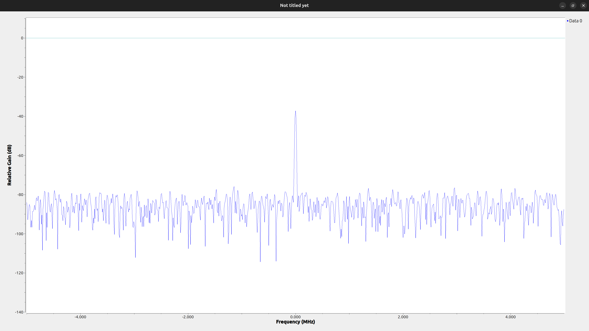

# HackRF IQ Data Capture and GNU Radio Companion Flowgraph

This lesson documents the steps we've taken to capture raw IQ data using a HackRF and process it in GNU Radio Companion (GRC) for visualization. (Installation steps for HackRF and GNU Radio are not included here.)

## Overview

- **HackRF Data Capture:**  
We used the `hackrf_transfer` utility to capture raw IQ samples. The HackRF outputs IQ samples as interleaved signed 8-bit integers (one byte for I and one for Q).

- **GNU Radio Companion Flowgraph:**  
We designed a GRC flowgraph that reads the raw IQ file, converts the interleaved 8-bit data into a complex float stream (the internal format used by most GNU Radio blocks), and visualizes its spectrum.

## Capturing IQ Data from HackRF

1. **Verify Device Connection:**
Connect your HackRF and run:
```bash
hackrf_info
```
2. **Capture IQ Samples:**
Use the following command to capture 1,000,000 samples (at the [default sample rate of 10 MS/s](https://github.com/greatscottgadgets/hackrf/blob/e5cfe1ac2b4d0621705ba3006d0f8abd447f50a3/host/hackrf-tools/src/hackrf_transfer.c#L107)) and save them to a file:
```bash
hackrf_transfer -r sample.iq -n 1000000
```
Note:
- The `-r sample.iq` option directs HackRF to write the received data into the file `sample.iq`.
- The `-n 1000000` option tells it to capture one million samples.
- The resulting file contains interleaved data: the first byte is I₁, the second is Q₁, third is I₂, fourth is Q₂, and so on. When you open sample.iq in a terminal text editor (like nano, vim, or less), you’re seeing nonsense characters because the file contains raw binary data, not readable text. Each I/Q value is a signed 8-bit integer.
- By default, each I+jQ value is sampled at 10 MS/s. If you ever need to change it, you can pass `-s <rate>` to `hackrf_transfer` (e.g. `-s 20e6` for 20 MS/s, the [maximum sample rate](https://github.com/greatscottgadgets/hackrf/blob/e5cfe1ac2b4d0621705ba3006d0f8abd447f50a3/host/hackrf-tools/src/hackrf_transfer.c#L106)).
- By default, when you don’t give it any -f options,​hackrf_transfer sets the local oscillator to [1GHz](https://github.com/greatscottgadgets/hackrf/blob/e5cfe1ac2b4d0621705ba3006d0f8abd447f50a3/host/hackrf-tools/src/hackrf_transfer.c#L109).

## Processing the IQ Data in GNU Radio Companion

This section explains how to build a flowgraph in GNU Radio Companion (GRC) that converts the raw file into a complex stream and visualizes its spectrum.

### 1. Convert the Byte Stream to Complex IQ Data
1. **Add a File Source**  
   - Drag a **File Source** block onto the canvas.  
   - Set **File** to `./sample.iq`.  
   - Set **Output Type** to `byte` (reads each 8-bit signed I/Q sample as a byte).
2. **Add an IChar to Complex Converter**  
   - From **Core → Type Converters**, drag **IChar to Complex** onto the canvas.  
   - Double-click to open its properties and set:
     - **Scale**: `127`  
       (this normalizes the raw –128…127 integers into approximately –1.0…+1.0 floats)  
    - The output of the **IChar to Complex** (or **Throttle**) block is now a stream of `std::complex<float>` at 10 MS/s, ready for visualization in the QT GUI Frequency Sink.3.
   - Wire the **File Source** output to the **IChar to Complex** input.  
4. Set the variable `samp_rate` to `10e6` (10 MHz)  
  - Defines the SDR sampling rate in Hz  
  - Sets the digital baseband bandwidth (± fₛ/2 = ± 5 MHz)  
5. **(Optional) Throttle**  
   - If you plan to play back a file without real-time hardware, insert a **Throttle** block after **IChar to Complex** and set **Sample Rate** to `10e6`.
6. Visualize the Signal
  - QT GUI Frequency Sink:
    - Connect the output of the Float to Complex block (or the Throttle block if used) to this sink.
    - Set the bandwidth to 10MHz. We purposefully set `Bandwidth = samp_rate` because the sink uses that value to map digital bins to real-world frequencies and to scale the power axis correctly. Without it, you’d just get a generic plot with arbitrary units.
    - Set the Center Frequency to 0 (since the data is now baseband).
    - Adjust autoscale or y-axis limits as needed.
7. Run the Flowgraph
  - Save the flowgraph.
8. Click the green “Play” button.

---

You should now see the spectrum display, which represents the frequency content of your captured IQ data.



